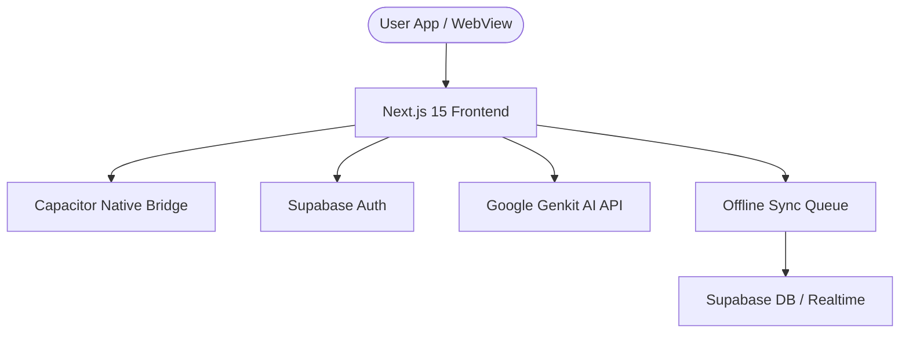

# TaskMaster Pro – Architecture Report

This report outlines the technical architecture, design principles, and component layouts of the TaskMaster Pro application.

---

## 1. System Overview

TaskMaster Pro is a modern task and meeting management workspace built on **Next.js 15**, **React 19**, and **Supabase**, packaged for mobile devices (Android and iOS) using **Capacitor 8.3**.

---

## 2. Key Components

### 2.1 Frontend layer (Next.js & React)
- **App Router Routing**: Organized into dynamic client-side pages under `src/app/` (dashboard, tasks, meetings, calendar, settings).
- **Theme and Providers**: Centralized providers for theme management (light/dark mode via `next-themes`) and session controls.
- **Shared Primitives**: Standardized shadcn/ui React components built on top of Radix UI primitives and styled with TailwindCSS.

### 2.2 Offline-First Sync Layer
- **Local Cache**: Hooks fallback to standard `localStorage` cached data if the remote network request fails.
- **Operation Interceptor**: Checks `navigator.onLine` on data mutations. If offline, the mutation payload is appended to an offline sync queue.
- **Background Flusher**: Automatically replays queued events (creations, updates, deletions) once the browser fires the `online` event or triggers a synchronization cycle.

### 2.3 Mobile Integration Bridge (Capacitor)
- **Web-to-Native**: Capacitor loads the Next.js production builds inside native WebViews.
- **Local Reminders**: Schedules and manages time-based alarms on mobile devices via `@capacitor/local-notifications`.

### 2.4 Generative AI Integration (Genkit & Gemini)
- **Genkit Server Client**: Set up on Next.js API routes, executing server-side calls securely.
- **Transcripts Structuring**: Summarizes talking points and auto-extracts action items from raw meeting notes.

---

## 3. Data Flow

1. **Authentication**: Handled via Supabase Go/PKCE OAuth redirects, setting secure sessions in client cookies/localStorage.
2. **Read Operations**: React hooks fetch from Supabase. Successful requests refresh the local cache; failed requests fall back to cache.
3. **Write Operations**: Operations write directly to Supabase if online, triggering a real-time postgres_changes event to sync all open tabs. If offline, the operation is queued locally and optimistically rendered in the UI.
